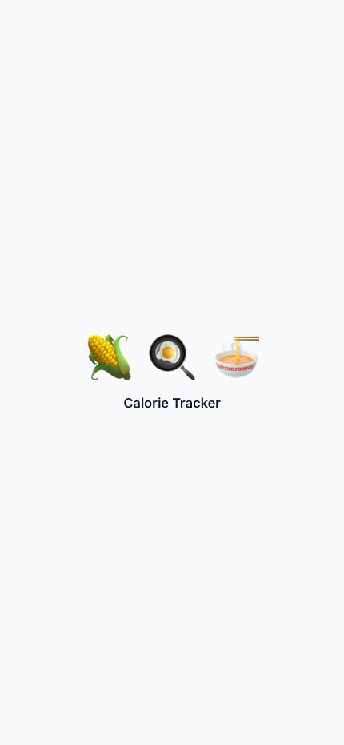
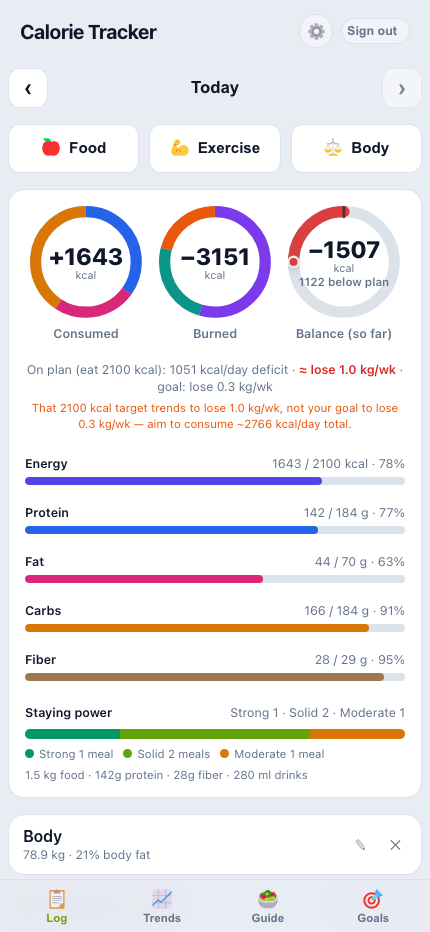
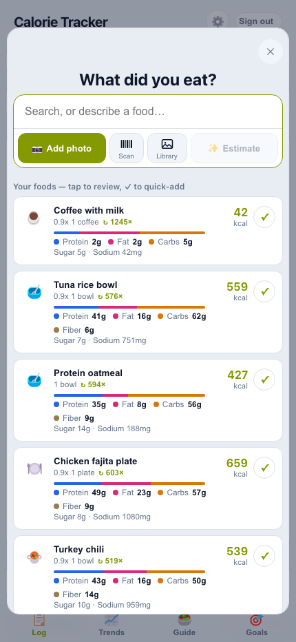
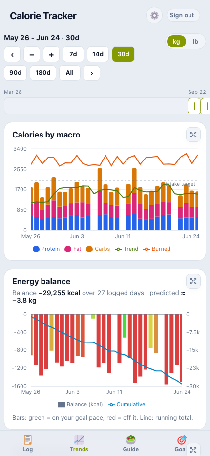
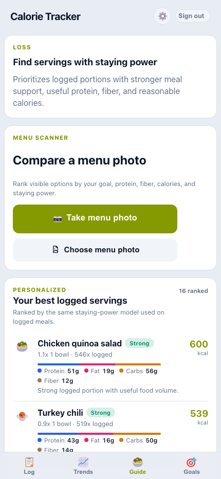
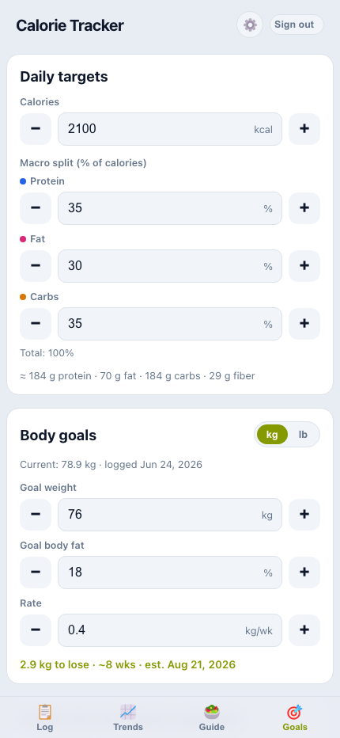

# Calorie Tracker

Snap a photo of food → get estimated calories + macros (via OpenRouter / Gemini 3 Flash
Preview) → log it and see daily totals. Installable to your iPhone home screen as a PWA.

**Architecture:** a decoupled **FastAPI + SQLite** backend (owns the photo→macros estimation
and persistence) and a thin **Vite + React PWA** frontend that talks to it over `/api`. The
frontend is swappable — a native Expo app could later use the same backend unchanged.

```
app/            FastAPI backend (analyze + entries, SQLite, OpenRouter wrapper)
web/            Vite + React + TypeScript PWA
tests/          pytest backend tests
docs/           Product, launch, and implementation planning docs
```

## Screenshots

Generated from local QA data with `cd web && npm run screenshots`.

<table>
  <tr>
    <td align="center">
      
      <br />
      <sub>Loading</sub>
    </td>
    <td align="center">
      
      <br />
      <sub>Log</sub>
    </td>
    <td align="center">
      
      <br />
      <sub>Add food</sub>
    </td>
  </tr>
  <tr>
    <td align="center">
      
      <br />
      <sub>Trends</sub>
    </td>
    <td align="center">
      
      <br />
      <sub>Guide</sub>
    </td>
    <td align="center">
      
      <br />
      <sub>Goals</sub>
    </td>
  </tr>
</table>

## Project docs

- [AGENTS.md](AGENTS.md) is the canonical guide for AI coding agents working in this repo.
- [docs/BACKLOG.md](docs/BACKLOG.md) tracks implementation roadmap and feature context.
- [docs/COMMERCIAL_READINESS.md](docs/COMMERCIAL_READINESS.md) tracks App Store, launch,
  monetization, privacy, domain, and deployment readiness.
- [docs/PRODUCT_MATURITY_ROADMAP.md](docs/PRODUCT_MATURITY_ROADMAP.md) prioritizes work
  that improves product credibility, demo quality, and external legibility.
- [docs/PRODUCT_OPPORTUNITIES.md](docs/PRODUCT_OPPORTUNITIES.md) tracks market-led product
  opportunities and differentiator ideas.
- [web/README.md](web/README.md) has frontend-specific commands and conventions.

## Prerequisites

- Python 3.12+ and [uv](https://docs.astral.sh/uv/) (or pip)
- Node 20+
- An [OpenRouter API key](https://openrouter.ai/keys) (only needed for photo estimation)

## Setup

```bash
# Backend deps
uv venv && uv pip install -e ".[dev]"

# Secrets — copy the template and put your real key in .env (which is gitignored)
cp .env.example .env
# then edit .env: set OPENROUTER_API_KEY=sk-or-v1-...

# Frontend deps
cd web && npm install && cd ..
```

## Local development (two-server, best DX)

Run the backend and the Vite dev server side by side. Vite proxies `/api` → FastAPI, so the
browser makes same-origin calls (no CORS).

```bash
# Terminal 1 — API on :8000
uv run uvicorn app.main:app --reload --host 0.0.0.0 --port 8000

# Terminal 2 — PWA on :5173
cd web && npm run dev
```

Open http://localhost:5173. Take/upload a food photo → review the estimate → save → see it in
the Log tab with daily totals.

## Testing on your iPhone

The iOS camera and PWA install require a **secure (HTTPS) context**, which plain LAN HTTP
(`http://192.168.x.x`) does not satisfy. Easiest path is a tunnel:

```bash
cd web && npm run build && npm run preview   # serves the built PWA on :4173
# in another terminal, tunnel it (also tunnel :8000 or run integrated mode below):
npx cloudflared tunnel --url http://localhost:4173
```

Open the HTTPS URL in iOS Safari → **Share → Add to Home Screen**. Launch it; it runs
full-screen like a native app. (For the API to be reachable too, the simplest option is the
integrated/deployed mode below, where one HTTPS origin serves both.)

## Integrated mode (one service serves API + PWA)

```bash
cd web && npm run build && cd ..
SERVE_STATIC=true uv run uvicorn app.main:app --host 0.0.0.0 --port 8000
# now http://localhost:8000 serves the PWA AND /api
```

## Tests & lint

```bash
uv run pytest          # backend tests
uv run ruff check app tests
cd web && npm run build  # type-checks the frontend
```

## Deploy (Fly.io)

The `Dockerfile` builds the PWA and serves it from FastAPI in integrated mode. A persistent
volume at `/data` keeps the SQLite DB and uploaded photos across redeploys.

```bash
fly launch --no-deploy                 # pick a unique app name; updates fly.toml
fly volumes create data --size 1 --region <region>

# Runtime secrets (persist across deploys). See "Authentication" below for the auth ones.
fly secrets set OPENROUTER_API_KEY=sk-or-v1-... \
  GOOGLE_CLIENT_ID=...apps.googleusercontent.com \
  JWT_SECRET="$(openssl rand -hex 32)" \
  ALLOWED_EMAILS="you@gmail.com,partner@gmail.com" \
  OWNER_EMAIL="you@gmail.com" \
  COOKIE_SECURE=true

fly deploy   # no --build-arg needed: VITE_GOOGLE_CLIENT_ID lives in fly.toml [build.args]
```

Fly provides HTTPS automatically, so the deployed URL works for camera + PWA install on iPhone
with no extra setup. Railway works similarly (Docker build + a volume mounted at `/data`).

## Authentication (Google sign-in)

The app is gated behind Google sign-in with a closed email allowlist (no public signup). The
same Google **OAuth Web client ID** is needed in two places that work differently — this trips
people up:

- **Frontend — `VITE_GOOGLE_CLIENT_ID` (build time).** Vite *inlines* it into the JS bundle at
  build, so it must be present whenever the PWA is built — a runtime env var/secret is too late.
  - Local dev: put it in `web/.env.local`.
  - Fly: it lives in `fly.toml` under `[build.args]`, so `fly deploy` always supplies it (no
    `--build-arg` needed). A client ID is **public** — it ships in the bundle — so committing it
    is fine.
- **Backend — runtime config/secrets** (set once via `fly secrets`, persist across deploys):
  `GOOGLE_CLIENT_ID` (verifies the ID token), `JWT_SECRET` (signs the session cookie; generate
  with `openssl rand -hex 32`), `ALLOWED_EMAILS` (CSV allowlist), `OWNER_EMAIL` (this account's
  first login adopts any pre-auth rows), and `COOKIE_SECURE=true` in production (HTTPS).

**Google Cloud Console** → APIs & Services → Credentials → **OAuth client ID (Web)**. Add your
app origins (e.g. `http://localhost:5173` and your deployed `https://…`) to **Authorized
JavaScript origins**; no redirect URI is needed (the sign-in button returns the token to JS).
Keep the deployed URL, `CORS_ORIGINS`, and the Authorized JavaScript origins all pointing at the
**same origin**, or sign-in/CORS will fail.

### Local QA auth

For local browser/API testing without Google, enable the local-only QA login endpoint:

```bash
QA_AUTH_ENABLED=true
QA_AUTH_SECRET=pick-a-local-secret
QA_AUTH_ACCOUNTS="qa-loss|qa-loss@example.test|QA Loss,qa-gain|qa-gain@example.test|QA Gain,qa-sporadic|qa-sporadic@example.test|QA Sporadic"
```

Run the backend, open `http://localhost:8000/docs` in the same browser, and execute
`POST /api/auth/qa` with:

```json
{ "account": "qa-loss", "secret": "pick-a-local-secret" }
```

That creates/reuses the configured QA user and sets the same httpOnly `ct_session` cookie
as Google sign-in. Then open the PWA. Use the same hostname everywhere (`localhost` vs
`127.0.0.1`) so the browser sends the cookie to the app/API. The QA endpoint rejects
non-local hosts and is intentionally not shown in the frontend.

To populate those QA accounts with local sample data, dry-run the seeder first:

```bash
uv run python scripts/seed_qa_data.py
uv run python scripts/seed_qa_data.py --yes
```

The seeder replaces only the generated QA personas' data. It includes a dense five-year
weight-loss history, an 18-month muscle-gain history, and a sparse six-month user.

Frontend browser checks can log in through the same QA endpoint:

```bash
cd web && npm run test:e2e
cd web && npm run screenshots
```

The screenshot script writes iPhone-sized captures for each QA persona to
`web/screenshots/` and clears stale screenshot output each run.

## API reference

| Method | Path | Purpose |
|---|---|---|
| `POST` | `/api/analyze` | Upload a photo → `{ photo_ref, analysis }` (stateless, no DB write) |
| `POST` | `/api/entries` | Create a logged entry |
| `GET` | `/api/entries?date=YYYY-MM-DD` | List entries for a day |
| `GET` | `/api/entries/summary?date=YYYY-MM-DD` | Calorie + macro totals for a day |
| `GET` / `PATCH` / `DELETE` | `/api/entries/{id}` | Read / edit / delete an entry |
| `GET` | `/api/health` | Health check |

Photos are served as static files at `/photos/<ref>`.

## Configuration

All backend config is env-driven (see `.env.example`): `OPENROUTER_API_KEY`, `OPENROUTER_MODEL`,
`USDA_API_KEY`, `DB_PATH`, `PHOTOS_DIR`, `SERVE_STATIC`, `STATIC_DIR`, `CORS_ORIGINS`, and the
auth vars (`GOOGLE_CLIENT_ID`, `JWT_SECRET`, `ALLOWED_EMAILS`, `OWNER_EMAIL`, `COOKIE_SECURE` —
see [Authentication](#authentication-google-sign-in)). The frontend reads `VITE_API_BASE_URL`
and `VITE_GOOGLE_CLIENT_ID` (see `web/.env.example`).

## Notes & deferred work

- **Timestamps** are stored as the device's local wall-clock time (single user, single device).
- **Multi-user via Google OAuth** with an email allowlist; every table is scoped by `user_id`
  and `app/deps.py` holds the `get_current_user` + per-user query helpers. See
  [Authentication](#authentication-google-sign-in).
- The backend is the source of truth; there's no offline queue (iOS PWAs can evict storage).
- Deferred: Apple Health/HealthKit, accounts, Postgres, push reminders, native Expo client.

## Agent notes

Before non-trivial code changes, read [AGENTS.md](AGENTS.md) and the relevant docs under
`docs/`. The worktree may contain in-progress user changes; do not revert or overwrite
unrelated files. For schema changes, use the additive SQLite migration pattern in
`app/db.py` and add tests.
